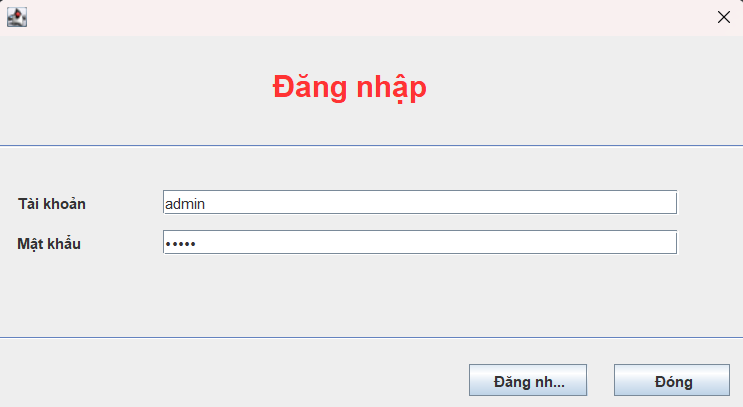
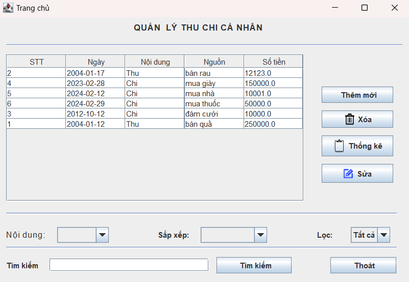
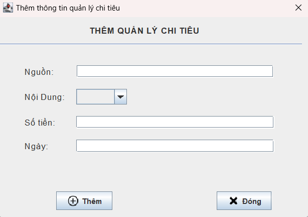
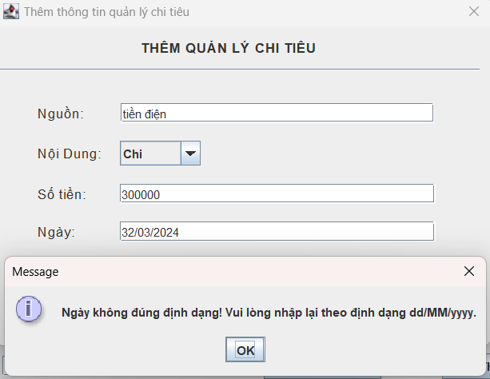
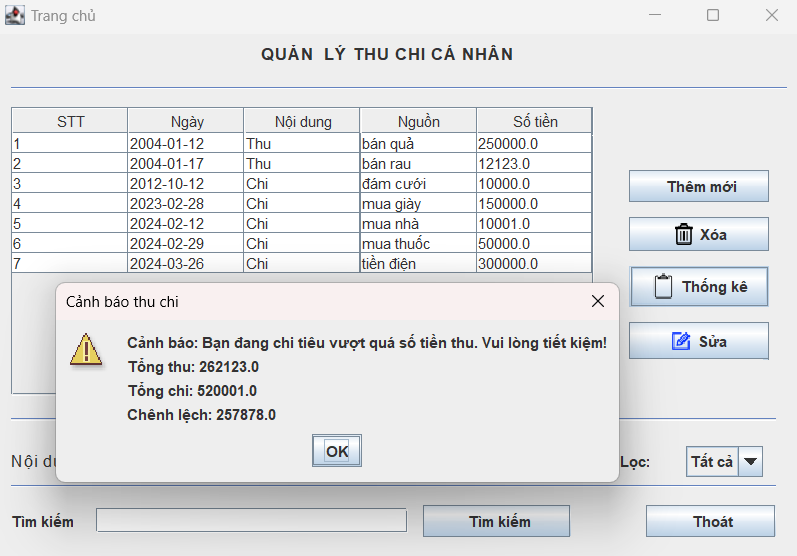

# QuanLiChiTieu
## Tổng quát

Hiện nay, việc theo dõi và kiểm soát chi tiêu hàng ngày đang trở nên khó khăn đối với nhiều người do sự phức tạp của cuộc sống và quá nhiều lựa chọn tiêu dùng. Để giải quyết vấn đề này, sự ra đời của dự án QuanLiChiTieu là giải pháp hiệu quả. Ứng dụng này giúp tự động ghi chép, phân loại và phân tích chi tiêu, giúp người dùng có cái nhìn tổng quan và kiểm soát tốt hơn về tài chính cá nhân. 

## Thành viên

1. Vũ Tuấn Anh 22010203
2. Nguyễn Trung Hiếu 22010486

## Cách dùng
**1. Đăng nhập**

Dự án được phát triển trên IntelliJ IDEA nên để chạy, người chạy file **run.java**. Sau khi chạy, cửa sổ đăng nhập sẽ hiện ra, lúc này, người dùng sẽ nhập `admin` trong ô **`Tài khoản`** và **`Mật khẩu`** sau đó nhấn vào nút **`Đăng nhập`** để truy cập vô phần mềm

**2. Nhập dữ liệu**

Sau khi đăng nhập thành công, màn hình sẽ hiển thị bảng chi tiêu

Để thêm dữ liệu chi tiêu, người dùng nhấn vào nút **`Thêm mới`**

Lúc này, người dùng sẽ nhập dữ liệu mới vào:

- Mục **Nguồn**: người dùng sẽ nhập nguồn thu/chi đến từ đâu. Ví dụ: mua sắm, làm thêm, tiền điện,...
- Mục **Nội dung**: Người dùng sẽ xác định đây là nguồn thu hay nguồn chi bằng cách chọn giữ 2 ô **Thu** và **Chi**
- Mục **Số Tiền**: Nhập tiền
- Mục **Ngày**: Người dùng sẽ nhập ngày tháng theo định dang dd/mm/yyyy, nếu nhập sai màn hình sẽ hiển thị thông báo lỗi

**3. Sử dụng các chức năng khác**

- **Xóa**: Người dùng chọn ô chi tiêu muốn xóa trong bảng sau đó nhấn nút `Xóa`
- **Sửa**: Người dùng cũng chọn ô chi tiêu muốn sửa trong bảng sau đó nhấn nút `Sửa` để chỉnh sửa lại nội dung đó
- **Sắp xếp**: có 4 cách sắp xếp tùy theo nhu cầu của người dùng: sắp xếp theo **Tên**, **Thời gian**, **Số Tiền**, **STT**
- **Lọc**: người dùng sẽ chọn `Chi` hoặc `Tiêu`, sau đó bảng chi tiêu sẽ được điều chỉnh lại sao cho hiển thi đúng nội dung Chi(Tiêu) mà người dùng đã chọn
- **Tìm kiếm**: Người dùng sẽ nhập vào ngày tháng theo đúng định dạng `dd/mm/yyyy` sau đó nhấn vào nút `Tìm kiếm` rồi màn hình sẽ hiển thị kết quả
- **Thống kê**: màn hình sẽ hiển thị thông tin tổng số tiền đã thu / chi và mức chênh lệnh giữa 2 nguồn này. Nếu nguồn chi lớn hơn nguồn thu thì sẽ cảnh báo

## Tổng kết

Dự án **QuanLiChiTieu** là một phần mềm giúp người dùng có thể thực hiện việc chi tiêu một cách hợp lí, hạn chế được những rủi ro liên quan đến việc chi tiêu, đồng thời cũng giúp người dùng tối ưu hóa được việc chi tiêu từ đó có thể dễ dàng hoàn thành các mục tiêu hay kế hoạch tài chính. Hiện tại dự án vẫn còn có những thiếu sót, rất mong người dùng có thể kiên nhẫn chờ đợi trong thời gian đội ngũ phát triển khắc phục và hoàn thiện dự án để đem đến cho người dùng nhanh nhất có thể! Xin cảm ơn!